# Alojamento Ideal Data Architecture

Status: target architecture, partially implemented  
Last researched: 2026-06-14  
Last updated: 2026-06-19  
Scope: `apps/web` rewrite, using the legacy repository as the behavioral baseline

> **Reading this document.** Sections marked _(as built)_ describe decisions already
> implemented in the codebase. The remaining sections are the **proposed target** for
> features not yet built; where a target section has been superseded by an implementation
> decision, it carries a **Superseded** note pointing to the relevant _(as built)_ section.
> Legacy sections (§2.x, §16) describe the old MongoDB application and are historical
> reference for migration only.

## 1. Executive Decision

Two data layers carry the system, with a third for coordination:

1. **PostgreSQL is the system of record for commerce and operations, and the durable
   read model for provider catalog content.**
   It owns orders, order items, customers, provider bookings, payment state, refunds,
   invoices, guest registration data, conversations, integration events, jobs, and audit
   history — and the cached Hostify/Bokun catalog projections. The original plan put the
   catalog in MongoDB; that was dropped in favor of a single PostgreSQL store (see §1A).
2. **Redis is the ephemeral coordination layer.**
   It owns rate-limit counters and (later) short-lived availability/price responses,
   distributed locks, and deduplication hints. It is never a system of record. Catalog
   read responses are cached in Next.js's data cache, not Redis (see §1A).
3. **Sentry owns error capture; PostgreSQL owns analytics.** Observability is split:
   exceptions go to Sentry, per-request analytics events are persisted to PostgreSQL,
   and Redis is reserved for rate limiting.

The browser must only call the `apps/web` route handlers. The web application must not call
Hostify, Bokun, Stripe, or Hostkit directly from the client.

At checkout, cached data is advisory. Availability, prices, fees, booking questions, and
provider configuration must be revalidated against the relevant provider before creating
or confirming a booking.

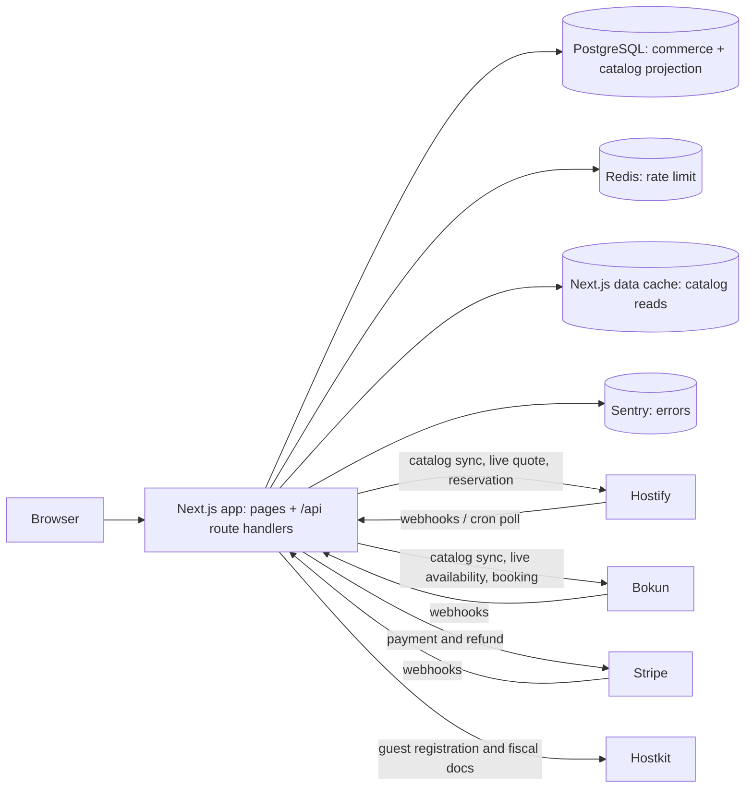

## 1A. Current Implementation (as built)

The decisions below are implemented and supersede the corresponding proposals later in
this document.

### Application shape

- **One deployable: `apps/web`** (Next.js 16, App Router). There is no separate
  `apps/api`/Elysia service. The API boundary is Next.js **route handlers** under
  `apps/web/app/api/*`. Shared domain logic lives in `@workspace/core`; the Drizzle schema
  and client live in `@workspace/db`.
- Every API route is wrapped by `withApiRoute` (`apps/web/lib/api.ts`), which applies
  rate limiting, structured logging, Sentry capture, and per-request analytics.

### Catalog store and read API

- The catalog projection is a single PostgreSQL table, `accommodation_listing`, not a
  MongoDB collection. Search uses PostgreSQL full-text (`tsvector` + `websearch_to_tsquery`
  over an accent-folded `immutable_unaccent` vector), trigram similarity for typo-tolerant
  place matching, and a haversine bounding-box + distance filter for radius search.
- Read endpoints: `GET /api/catalog/listings` (filter/sort/paginate) and
  `GET /api/catalog/listings/[externalId]` (localized detail). Query parsing and the
  `CatalogRepository` live in `@workspace/core/catalog`.

### Catalog read caching and invalidation

- Caching uses **Next.js Cache Components** (`cacheComponents: true`). The repository reads
  are wrapped in `use cache` functions in `apps/web/lib/catalog-cache.ts` with
  `cacheLife('max')` as a safety TTL.
- Invalidation is **event-driven from the sync cron**, since the cron is the only writer
  and knows exactly which listings changed:
  - **Detail** entries are tagged per listing (`catalog:listing:{provider}:{account}:{externalId}`)
    and revalidated precisely.
  - **List** entries share one collection tag (`catalog:listings`) that is dropped whenever
    any listing changes — a created or newly-qualifying listing is not referenced by any
    existing list entry, so per-item tags alone cannot catch it.
  - The Hostify sync reports `changedExternalIds`; the cron route calls `revalidateTag` for
    the collection tag and each changed listing.
- Deployment is single-instance, so Next.js's in-memory data cache persists across requests
  and `revalidateTag` reaches the one cache. A multi-instance deployment would require a
  shared cache handler (`cacheHandlers`, e.g. Redis-backed).

### Listing sync

- A lease-based incremental cron poll (`GET /api/cron/hostify/listings`, bearer
  `CRON_SECRET`) advances page-by-page using `provider_sync_state`, records each run in
  `provider_sync_run`, and upserts changed listings by source hash. Implementation lives in
  `@workspace/core/listing-cache`.

### Observability and rate limiting

- Errors → Sentry. Per-request analytics events → PostgreSQL. Redis → rate-limit counters
  only (per-route buckets, with an in-memory insurance limiter so a Redis outage degrades
  gracefully rather than failing requests).

## 2. Why This Boundary

The legacy application stores one MongoDB `Order` document containing customer details,
arrays of Hostify reservation IDs, Bokun booking IDs, Stripe IDs, transaction IDs,
provider-specific item snapshots, discounts, and invoice references. Relationships between
items and provider records depend on array position. That makes partial failure,
reconciliation, reporting, and migration difficult.

The legacy application also reads catalog, price, availability, reservation, and message
data directly from providers during page rendering. This creates unnecessary provider
load and makes site availability dependent on provider response time.

The target architecture separates:

- **Business truth:** facts that Alojamento Ideal must preserve and reconcile.
- **Provider truth:** mutable facts owned by Hostify, Bokun, Stripe, or Hostkit.
- **Cached projections:** provider data copied locally to make reads fast and resilient.

### 2.1 Legacy Current-State System Context

This section documents the application in
`E:\Ocean Informatix\AlojamentoIdeal.pt\alojamentoideal` as it currently behaves. It is a
reference for migration and reconciliation, not the proposed target architecture.

The legacy Next.js application contains the web UI, server actions, provider connectors,
webhook routes, and cron routes in one deployment. Catalog pages call Hostify and Bokun
directly without a durable local catalog cache. MongoDB stores application-created orders,
guest details, chats/messages, admins, and per-listing Hostkit credentials.

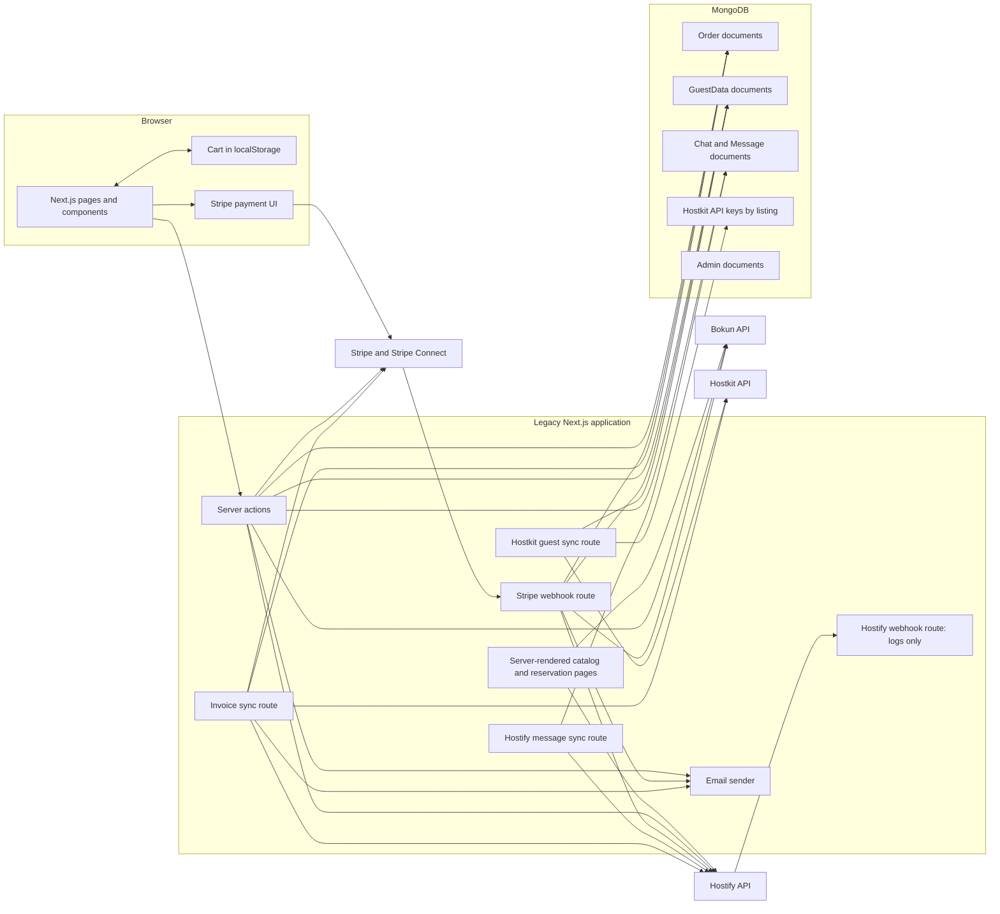

Current read behavior:

- Cart items live in browser `localStorage` under `alojamentoideal.cart`.
- Accommodation search, detail, translations, calendar, prices, reservation detail, and
  inbox data are read directly from Hostify.
- Activity search/detail, availability, pickup places, booking detail, questions, tickets,
  and booking summaries are read directly from Bokun.
- The tours page searches Bokun but renders a hardcoded environment-specific list of
  activity IDs.
- Order and admin pages read the MongoDB order document, then retrieve current Stripe
  PaymentIntent/charge state on demand.
- The Hostify webhook route currently acknowledges and logs the request but does not update
  application state.
- The Hostify sync route polls Hostify reservation inboxes and imports provider messages
  into local MongoDB chats.
- Messages written in the local chat are stored in MongoDB and trigger email notifications;
  the observed `postMessage` action does not send those messages to Hostify.
- Cron route implementations exist, but a concrete schedule configuration is not present in
  the legacy repository.

### 2.2 Legacy Cart and Checkout Inputs

The browser cart is a union of:

- accommodation items containing Hostify listing ID, dates, party counts, displayed price,
  photo, and fees;
- activity items containing Bokun experience ID, date, rate, start time, pricing-category
  guest counts, displayed price, and photo;
- future/general product items.

At checkout, the client also submits customer/contact data, billing address, accommodation
guest registration data, Bokun booking questions, and an optional discount code. The server
re-fetches Hostify prices, but the order still embeds provider-specific item snapshots and
parallel arrays of provider IDs.

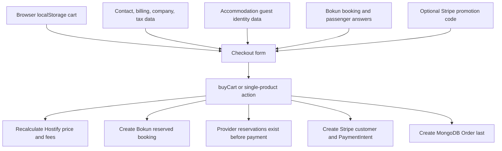

### 2.3 Legacy Mixed-Cart Order Creation

`buyCart` is the broadest current checkout path and supports accommodation and activity
items in one payment.

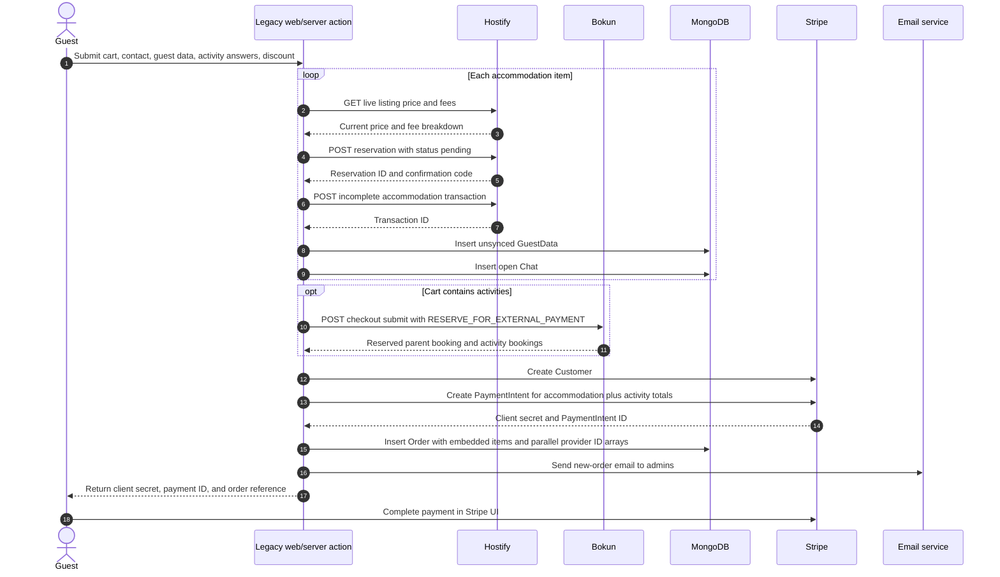

Important ordering:

1. Hostify pending reservations, Hostify transactions, guest records, and chats are created
   before the Stripe PaymentIntent and MongoDB order.
2. The Bokun external-payment reservation is also created before payment.
3. The MongoDB order is written only after provider reservations and PaymentIntent creation.
4. `registerOrder` sends the admin new-order email immediately, before Stripe confirms
   payment.
5. These steps are not wrapped in a transaction or durable saga.

The single-accommodation action uses the same external systems but a slightly different
order: it creates the Hostify pending reservation, then the Stripe PaymentIntent, Hostify
transaction, MongoDB order/admin email, Chat, and GuestData. The activity-only flow first
creates the Bokun reserved booking, optionally applies a Stripe promotion-code discount,
creates the Stripe PaymentIntent, then writes the MongoDB order.

### 2.4 Legacy Stripe Money Split

Let:

- `A` = sum of final Hostify accommodation amounts in minor units;
- `D` = Detours/Bokun activity amount in minor units;
- `T` = total customer charge, where `T = A + D`.

The current Stripe integration creates a destination charge on the Alojamento Ideal
platform account when activities are present.

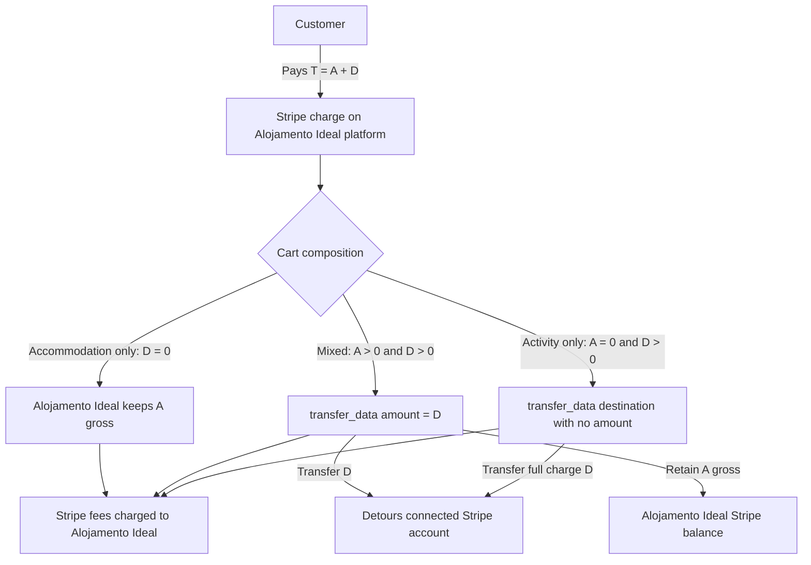

Observed allocation:

| Cart | PaymentIntent amount | Transfer to Detours | Gross retained by Alojamento Ideal before Stripe fees |
|---|---:|---:|---:|
| Accommodation only | `A` | `0` | `A` |
| Mixed accommodation/activity | `A + D` | explicit `D` | `A` |
| Activity only | `D` | full charge because transfer amount is omitted | `0` |

Stripe destination-charge semantics mean the Alojamento Ideal platform separately pays
Stripe processing fees on the full charge. Therefore:

- mixed-cart platform net is approximately `A - Stripe fees on T`;
- activity-only platform net is approximately `0 - Stripe fees on D`, unless another
  commercial arrangement reimburses those fees;
- Detours receives the transferred activity allocation before any later Bokun confirmation
  performed by the application.

Discount behavior differs by checkout path:

- accommodation-only and the accommodation portion of mixed carts apply the promotion
  discount through recalculated Hostify accommodation fees;
- activity-only applies the validated promotion discount to the amount transferred to
  Detours;
- the mixed-cart path leaves `D` at Bokun's returned total and records the discount metadata
  with `amountOffCents: 0`, so the discount is effectively applied to accommodation only.

The target architecture must preserve this intended commercial split explicitly using
`payment_allocations`, while also recording Stripe fees, transfers, reversals, refunds, and
net settlement for reconciliation.

### 2.5 Legacy Payment Success and Provider Confirmation

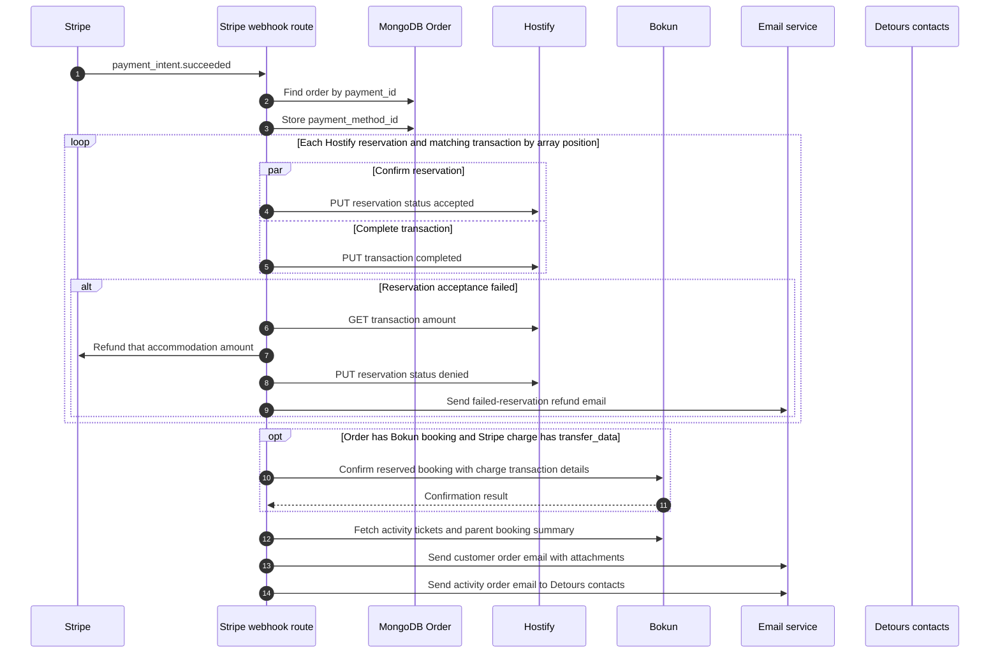

Additional current behavior:

- The Hostify transaction update is run in parallel with reservation acceptance. It can be
  marked completed even when reservation acceptance fails.
- A failed Hostify reservation is refunded by retrieving its Hostify transaction amount.
- Bokun confirmation receives the Stripe charge ID/card details and the transferred amount
  (`charge.transfer_data.amount`) or full charge amount.
- Bokun confirmation failures are only logged. They do not currently trigger a Stripe
  refund, transfer reversal, retry record, or staff recovery state.
- Customer email activity items are not filtered by Bokun confirmation success.
- Tickets and the Bokun parent-booking summary are fetched as PDFs and attached to the
  customer email.
- Detours contacts receive a separate activity-order email.
- The webhook handler has no durable event inbox or explicit idempotency guard, so repeated
  delivery can repeat side effects.

The `transfer.created` Stripe webhook finds the MongoDB order from the transfer group and
updates the destination payment description and metadata in the Detours connected account.

### 2.6 Legacy Payment Failure and Orphan Handling

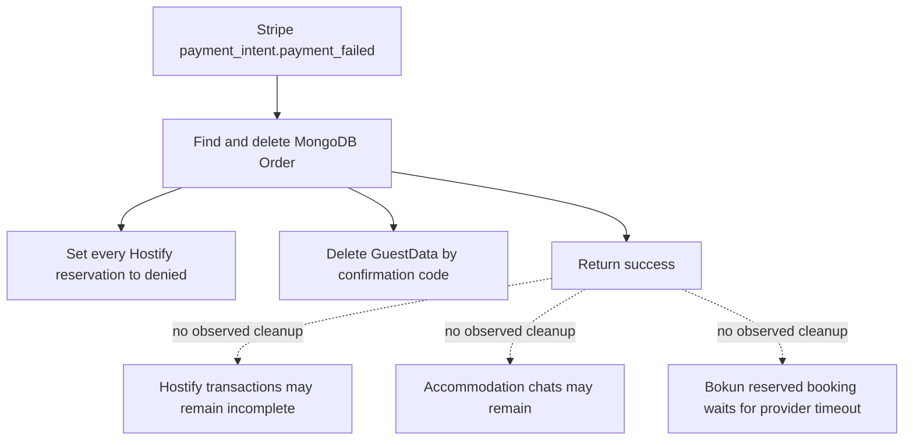

Separate admin order deletion:

- deletes the MongoDB order;
- sets Hostify reservations to `cancelled_by_host`;
- deletes matching local chats/messages and GuestData;
- marks Hostify transactions incomplete with an audit-like detail string;
- does not cancel Bokun activity bookings in the observed `deleteOrder` action.

Other orphan scenarios in the current checkout path:

- if Bokun reservation creation fails after Hostify pending reservations were created,
  `buyCart` returns failure without compensating those Hostify reservations;
- if PaymentIntent creation or MongoDB order insertion fails, previously created provider
  reservations may have no order record;
- provider IDs are associated to items using parallel arrays and position, making partial
  recovery fragile.

### 2.7 Legacy Guest Data and Hostkit SIBA Sync

GuestData is created for each accommodation reservation during checkout and can later be
created or updated through guest-facing actions. Updating guest data resets `synced` and
`succeeded` to `false`.

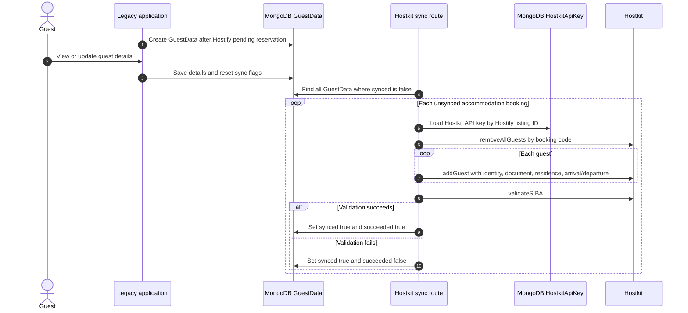

Current Hostkit implementation details:

- Hostkit credentials are plaintext MongoDB records keyed by Hostify listing ID.
- Hostkit calls use `GET` requests with the API key in the query string and a hardcoded
  `uid=331`.
- Before adding the current guests, the sync removes all Hostkit guests for the booking.
- A failed `addGuest` leaves the record unsynced for retry.
- An empty guest list is skipped and remains unsynced.
- `sendSIBA` is commented out. Current `succeeded: true` means `validateSIBA` succeeded; it
  does not prove that data was submitted to SIBA.
- Failed SIBA validation is stored as `synced: true, succeeded: false`, so it is not retried
  by the same unsynced-record query without another update resetting the flags.
- The route checks a bearer cron secret, but the actual schedule is not declared in the
  legacy repository.

### 2.8 Legacy Accommodation Invoice Flow

Accommodation invoices are not issued at payment success in the active code. A cron route
looks for eligible reservations at or after checkout.

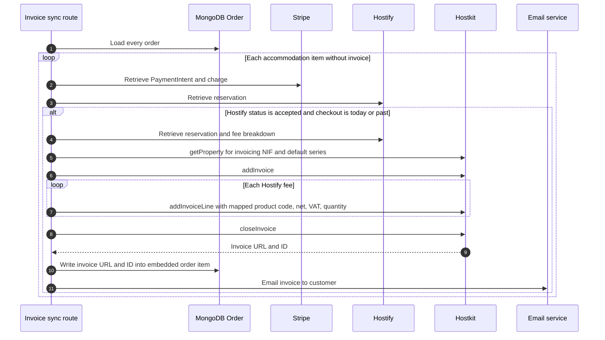

Fee mappings in the legacy code convert Hostify accommodation, tax, cleaning, utility, and
other fee names/types into Hostkit product codes and invoice-line types.

The current invoice helper returns after the first successfully attached invoice in one
invocation, so an order with multiple eligible accommodation items may require later cron
runs to invoice all items.

### 2.9 Legacy Cancellation and Refund Paths

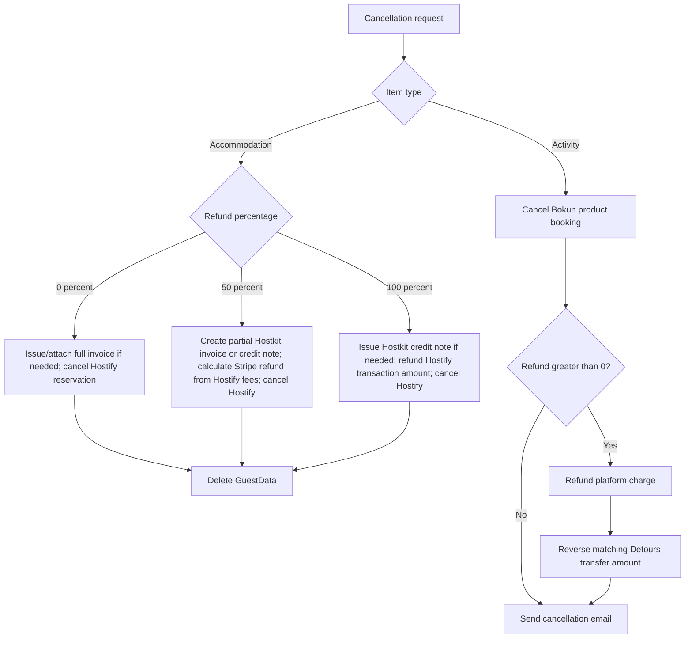

Accommodation cancellation uses Hostify fee data to calculate partial refunds and Hostkit
to create invoices/credit notes. If `cancelled_by_guest` fails, it falls back to
`cancelled_by_host`.

Activity cancellation first asks Bokun to cancel/refund the product booking. For a monetary
refund it then refunds the Stripe platform charge and explicitly reverses the matching
Detours transfer amount. This explicit reversal is necessary because Stripe destination
charge refunds do not pull transferred funds back by default.

Current cancellation/refund limitations:

- refund operations have no durable idempotency record;
- orders do not have normalized item/refund state transitions;
- accommodation refunds depend on array-position mapping and runtime Hostify fee data;
- activity refund amount and transfer reversal are separate calls without a durable saga;
- disputes and skipped/failed transfers have no observed handling.

### 2.10 Legacy Messaging and Reconciliation

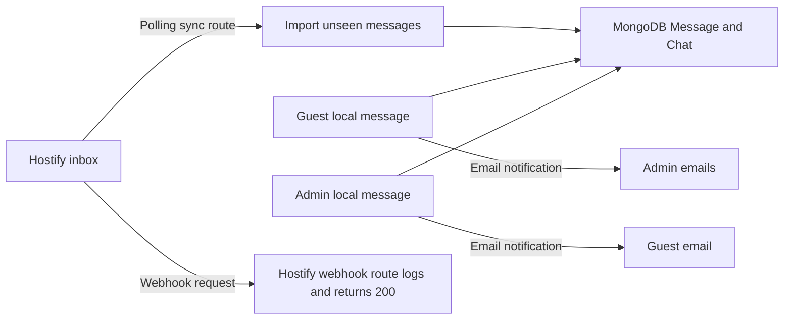

The current scheduled routes provide narrow repair processes:

- Hostify sync imports inbox messages for existing local chats.
- Hostkit sync retries unsynced guest records.
- Invoice sync searches all orders for accepted, checked-out accommodation reservations
  lacking invoices.

There is no general reconciliation process for:

- paid Stripe charges without a MongoDB order;
- MongoDB orders without provider bookings;
- Detours transfers without confirmed Bokun bookings;
- Bokun confirmation failures;
- Hostify reservation/transaction divergence;
- provider booking status drift;
- refunds, reversals, disputes, or chargebacks.

### 2.11 Legacy Current-State Risks to Preserve During Migration

The rewrite must explicitly detect and reconcile these legacy states before cutover:

| Legacy risk | Required migration/rewrite response |
|---|---|
| Provider reservations created before order persistence | Reconcile provider IDs and import orphans |
| Parallel arrays map items to reservations/transactions | Transform into direct item foreign keys |
| Admin email sent before payment success | Separate order-created from order-confirmed notifications |
| Activity funds transferred before Bokun confirmation | Track allocation, confirmation, transfer, and compensation independently |
| Bokun confirmation failure lacks refund/reversal | Add durable compensation workflow |
| Payment failure does not cancel Bokun hold | Add provider hold expiry/cancellation workflow |
| Hostify webhook is a no-op | Implement verified event intake plus reconciliation |
| Stripe webhook lacks durable idempotency | Add event inbox and idempotent handlers |
| Hostkit `succeeded` only means validation | Define submitted/validated/accepted states separately |
| Hostkit credentials stored in MongoDB | Move to secrets manager |
| Invoice/refund state embedded in order items | Normalize fiscal documents and refunds |
| Operational reads depend on live provider calls | Use PostgreSQL projections and explicit refresh jobs |
| No general financial reconciliation | Reconcile charge, transfer, fee, refund, reversal, and provider booking totals |

## 3. Provider Findings

### 3.1 Hostify

Hostify publicly states that its Open API supports real-time property management data,
reservation and guest-data import/export, and real-time webhooks. Detailed endpoint and
webhook contracts appear to require account-level documentation or Hostify support access.

The legacy application proves that the current Hostify account exposes at least:

| Concern | Legacy API usage |
|---|---|
| Accommodation search | `GET listings`, `GET listings/available` |
| Accommodation detail | `GET listings/{id}`, `GET listings/translations/{id}` |
| Availability | `GET calendar` |
| Live price and fees | `GET listings/price` |
| Reservations | `POST reservations`, `GET/PUT reservations/{id}` |
| Reservation fields | `GET reservations/custom_fields/{id}` |
| Provider transactions | `POST/GET/PUT transactions` |
| Messaging | `GET inbox/{message_id}` |
| Webhooks | `webhooks_v2`; legacy code references `message_new` |

Hostify should remain authoritative for accommodation listing configuration, live
availability, live fees/prices, accommodation reservation state, and Hostify inbox state.

Before implementing the connector, obtain written confirmation from Hostify for:

- all `webhooks_v2` notification types and payload schemas;
- webhook authentication/signature method, retry policy, ordering, and uniqueness key;
- whether a `pending` reservation holds inventory, and for how long;
- reservation idempotency support or an external-reference field;
- API rate limits, pagination, incremental-update filters, and sandbox behavior.

### 3.2 Bokun

Bokun supports:

- activity search and product-detail APIs;
- date-range availability, capacity, and pricing queries;
- direct booking requests and shopping carts;
- a reserve-then-confirm checkout flow for external payment;
- booking questions and answers;
- booking cancellation;
- product and booking webhooks.

Bokun documents that a reservation created with `RESERVE_FOR_EXTERNAL_PAYMENT` holds
availability for a maximum of 30 minutes. This is the correct flow for Stripe payments.

The legacy connector uses Bokun API-key authentication. Bokun documents a limit of
5 requests/second for app authentication and 100 requests/second for OAuth. The sync
worker must therefore throttle to the active authentication method.

Bokun currently documents two webhook verification contracts for different webhook
systems:

- App webhook subscriptions created through the current REST/GraphQL app API use
  `x-bokun-hmac-sha256`, calculated from the request body with the app client secret.
  These docs describe up to seven delivery attempts over roughly 21 hours.
- The older webhook endpoint documentation uses `X-Bokun-HMAC`, calculated from sorted
  `X-Bokun-*` headers with HMAC-SHA256, and documents a five-second response timeout.

Select one Bokun webhook system during provider contract validation, record its exact
contract, and build signature fixtures from Bokun-delivered test events. In either system:

- expect duplicate delivery and make processing idempotent;
- use product events to refresh/disable activity cache documents;
- use booking events to update operational booking state and invalidate availability.

Relevant event families include `BOOKING_*`, `PRODUCT_*`, `EXPERIENCE_*`, and
`AVAILABILITY_*`.

### 3.3 Stripe

Stripe remains authoritative for payment processing state. The application owns the
commercial order and its allocation of money to items/providers.

Use exactly one PaymentIntent per order. Only create a replacement as an explicit recovery
decision linked to the same order. Every Stripe mutation must use an idempotency key.
Stripe webhooks must be verified, stored, deduplicated, acknowledged quickly, and processed
asynchronously.

### 3.4 Hostkit

The legacy repository uses Hostkit for:

- Portuguese guest registration/SIBA workflows;
- property-specific API credentials;
- certified invoices, invoice lines, and credit notes.

This is an operational integration and must be represented in the target data model even
though it was not initially listed as a rewrite provider. Hostkit credentials must move
out of MongoDB and into a secrets manager.

## 4. Ownership Matrix

`Authoritative` means the named system decides the current value. `Projection` means the
new application stores a local copy for reads, joins, workflow, or audit.

| Data | Authority | Local storage | Notes |
|---|---|---|---|
| Hostify accommodation content | Hostify | PostgreSQL projection (`accommodation_listing`) | Serve stale content during short provider outages |
| App-owned slugs, publishing, SEO, and merchandising | Alojamento Ideal | PostgreSQL authoritative fields | Provider refresh must not overwrite |
| Hostify live availability | Hostify | Redis short TTL only | Never trust cache at checkout |
| Hostify live quote and fees | Hostify | Redis short TTL + PostgreSQL accepted snapshot | Revalidate before reservation |
| Hostify reservation status | Hostify | PostgreSQL projection | Webhook plus reconciliation |
| Hostify inbox messages | Hostify for provider messages | PostgreSQL projection | Local messages may also originate in app |
| Bokun activity content | Bokun | PostgreSQL projection | Product events refresh cache |
| Bokun live availability/pricing | Bokun | Redis short TTL only | Never trust cache at checkout |
| Bokun booking status | Bokun | PostgreSQL projection | Webhook plus reconciliation |
| Order and item state | Alojamento Ideal | PostgreSQL authoritative | Never derive only from provider arrays |
| Customer/order contact snapshot | Alojamento Ideal | PostgreSQL authoritative | Preserve checkout-time values |
| Payment state | Stripe | PostgreSQL projection | Stripe event ID is dedupe key |
| Item payment allocation | Alojamento Ideal | PostgreSQL authoritative | Required for partial refund/failure |
| Fiscal documents | Hostkit | PostgreSQL projection + object URL | Preserve immutable references and totals |
| Guest registration data | Alojamento Ideal until submitted; Hostkit after submission | PostgreSQL encrypted | Minimize retention |
| Webhook/event processing state | Alojamento Ideal | PostgreSQL authoritative | Required for idempotency and replay |
| Product analytics events and aggregates | Alojamento Ideal | Analytics store/warehouse | Never authoritative for orders or payments |
| Provider credentials | Secrets manager | PostgreSQL secret reference only | Never store plaintext API keys in app DB |

## 5. Data Conventions

### 5.1 Identifiers

- Use internal UUIDv7 IDs for all PostgreSQL entities.
- Expose a separate stable `public_reference` for orders, for example `AI-2026-XXXXXX`.
- Store every provider ID as `text`, even when the provider currently returns a number.
- Never use a provider ID as an internal primary key.
- Enforce uniqueness on `(provider, external_id, external_account_id)` where applicable.
- Store external parent and product confirmation codes separately; do not pack meaning into
  one text field.

### 5.2 Money

- Store money as integer minor units: `amount_minor bigint`.
- Store ISO-4217 currency as `currency text` with a three-uppercase-letter check constraint.
- Do not use floating point for money.
- Persist the accepted item price and charge breakdown at checkout. Historical orders must
  not change when provider prices change.
- Persist net, tax, and gross amounts separately where the provider supplies them.

### 5.3 Dates and Time

- Use `timestamptz` for instants and event timestamps.
- Use `date` for accommodation check-in/check-out and activity service dates.
- Store the provider/property timezone on the catalog projection and booking snapshot.
- Store provider raw timestamps as parsed `timestamptz` plus the raw payload when needed.

### 5.4 Provider Payloads

- Keep typed columns for fields used in constraints, joins, filtering, state machines, or
  reporting.
- Keep `raw_payload jsonb` in PostgreSQL only for operational provider records/events.
- Keep provider-shaped catalog content and the sanitized raw catalog payload in the
  PostgreSQL catalog projection (`accommodation_listing` typed columns plus JSONB).
- Never persist a full raw payload when it can contain access codes, credentials, private
  owner details, or unnecessary personal data.
- Add `schema_version` to application-owned JSON documents.

## 6. PostgreSQL Logical Schema

The schema below is the required logical model. Names can be adjusted to the selected ORM,
but ownership, constraints, and relationships should remain.

### 6.1 Customers and Order Contacts

#### `customers`

Long-lived customer/CRM identity. An order can exist without a reusable customer account.

| Column | Type | Rules |
|---|---|---|
| `id` | `uuid` | PK |
| `email` | `text` | normalized lowercase; nullable |
| `phone_e164` | `text` | nullable |
| `display_name` | `text` | nullable |
| `created_at` | `timestamptz` | required |
| `updated_at` | `timestamptz` | required |

Do not force email uniqueness until the account/guest identity policy is defined.

#### `order_contacts`

Immutable checkout-time contact and billing identity snapshot.

| Column | Type | Rules |
|---|---|---|
| `id` | `uuid` | PK |
| `order_id` | `uuid` | FK, unique |
| `customer_id` | `uuid` | nullable FK |
| `name` | `text` | required |
| `email` | `text` | required |
| `phone_e164` | `text` | required |
| `tax_number` | `text` | encrypted or access-restricted; nullable |
| `is_company` | `boolean` | required |
| `company_name` | `text` | nullable |
| `notes` | `text` | nullable |
| `billing_address` | `jsonb` | validated address object |
| `created_at` | `timestamptz` | required |

### 6.2 Orders and Items

#### `orders`

| Column | Type | Rules |
|---|---|---|
| `id` | `uuid` | PK |
| `public_reference` | `text` | unique, required |
| `status` | `text` | constrained state machine |
| `currency` | `text` | required; ISO-4217 check |
| `subtotal_minor` | `bigint` | required, non-negative |
| `discount_minor` | `bigint` | required, default `0` |
| `tax_minor` | `bigint` | required, default `0` |
| `total_minor` | `bigint` | required, non-negative |
| `amount_paid_minor` | `bigint` | required, default `0` |
| `amount_refunded_minor` | `bigint` | required, default `0` |
| `checkout_expires_at` | `timestamptz` | nullable |
| `failure_code` | `text` | nullable |
| `failure_detail` | `text` | nullable |
| `created_at` | `timestamptz` | required |
| `updated_at` | `timestamptz` | required |
| `confirmed_at` | `timestamptz` | nullable |
| `cancelled_at` | `timestamptz` | nullable |

Recommended order states:

`draft`, `validating`, `reserving`, `awaiting_payment`, `paid_confirming`,
`confirmed`, `partially_confirmed`, `payment_failed`, `compensation_required`,
`cancelled`, `refunded`, `partially_refunded`.

#### `order_items`

| Column | Type | Rules |
|---|---|---|
| `id` | `uuid` | PK |
| `order_id` | `uuid` | FK, indexed |
| `position` | `integer` | unique within order |
| `type` | `text` | `accommodation`, `activity`, or future `product` |
| `status` | `text` | item workflow state |
| `title_snapshot` | `text` | required |
| `image_url_snapshot` | `text` | nullable |
| `quantity` | `integer` | required, positive |
| `currency` | `text` | required; ISO-4217 check |
| `subtotal_minor` | `bigint` | required |
| `discount_minor` | `bigint` | required, default `0` |
| `tax_minor` | `bigint` | required |
| `total_minor` | `bigint` | required |
| `catalog_snapshot` | `jsonb` | minimal checkout-time display snapshot |
| `created_at` | `timestamptz` | required |
| `updated_at` | `timestamptz` | required |

#### `accommodation_item_details`

| Column | Type | Rules |
|---|---|---|
| `order_item_id` | `uuid` | PK/FK |
| `hostify_listing_id` | `text` | indexed |
| `check_in` | `date` | required |
| `check_out` | `date` | required; greater than check-in |
| `adults` | `integer` | non-negative |
| `children` | `integer` | non-negative |
| `infants` | `integer` | non-negative |
| `pets` | `integer` | non-negative |
| `property_timezone` | `text` | required |

#### `activity_item_details`

| Column | Type | Rules |
|---|---|---|
| `order_item_id` | `uuid` | PK/FK |
| `bokun_experience_id` | `text` | indexed |
| `service_date` | `date` | nullable for pass products |
| `start_time_id` | `text` | nullable |
| `rate_id` | `text` | nullable |
| `pickup_place_id` | `text` | nullable |
| `guest_counts` | `jsonb` | pricing-category ID to count |
| `answers_snapshot` | `jsonb` | validated booking/passenger answers |
| `activity_timezone` | `text` | required |

#### `order_item_charges`

Stores the accepted price breakdown used for invoice/refund calculations.

| Column | Type | Rules |
|---|---|---|
| `id` | `uuid` | PK |
| `order_item_id` | `uuid` | FK, indexed |
| `provider_charge_id` | `text` | nullable |
| `kind` | `text` | accommodation, fee, extra, tax, cost, discount |
| `name` | `text` | required |
| `quantity` | `numeric` | required |
| `unit_net_minor` | `bigint` | required |
| `net_minor` | `bigint` | required |
| `tax_minor` | `bigint` | required |
| `gross_minor` | `bigint` | required |
| `tax_rate_basis_points` | `integer` | nullable |
| `raw_payload` | `jsonb` | nullable |

### 6.3 Provider Bookings

#### `provider_bookings`

One row per provider booking/reservation, linked directly to its item.

| Column | Type | Rules |
|---|---|---|
| `id` | `uuid` | PK |
| `order_item_id` | `uuid` | FK, indexed |
| `provider` | `text` | `hostify` or `bokun` |
| `external_account_id` | `text` | required |
| `external_id` | `text` | required |
| `external_reference` | `text` | nullable |
| `parent_external_id` | `text` | nullable |
| `parent_external_reference` | `text` | nullable |
| `status` | `text` | normalized application status |
| `provider_status` | `text` | exact provider status |
| `starts_at` | `timestamptz` | nullable |
| `ends_at` | `timestamptz` | nullable |
| `hold_expires_at` | `timestamptz` | nullable |
| `last_synced_at` | `timestamptz` | nullable |
| `raw_payload` | `jsonb` | latest operational provider payload |
| `created_at` | `timestamptz` | required |
| `updated_at` | `timestamptz` | required |

Unique index:
`(provider, external_account_id, external_id)`.

#### `provider_financial_records`

Tracks Hostify transaction IDs and equivalent provider-side financial records without
confusing them with Stripe payments.

| Column | Type | Rules |
|---|---|---|
| `id` | `uuid` | PK |
| `provider_booking_id` | `uuid` | FK |
| `provider` | `text` | required |
| `external_id` | `text` | required |
| `type` | `text` | required |
| `status` | `text` | normalized |
| `amount_minor` | `bigint` | required |
| `currency` | `text` | required; ISO-4217 check |
| `raw_payload` | `jsonb` | nullable |
| `created_at` | `timestamptz` | required |
| `updated_at` | `timestamptz` | required |

### 6.4 Payments, Allocations, and Refunds

#### `payment_attempts`

| Column | Type | Rules |
|---|---|---|
| `id` | `uuid` | PK |
| `order_id` | `uuid` | FK, indexed |
| `provider` | `text` | initially `stripe` |
| `external_payment_intent_id` | `text` | unique |
| `external_customer_id` | `text` | nullable |
| `external_charge_id` | `text` | nullable |
| `status` | `text` | normalized |
| `provider_status` | `text` | exact Stripe status |
| `amount_minor` | `bigint` | required |
| `currency` | `text` | required; ISO-4217 check |
| `idempotency_key` | `text` | unique, required |
| `failure_code` | `text` | nullable |
| `created_at` | `timestamptz` | required |
| `updated_at` | `timestamptz` | required |

#### `payment_allocations`

Allocates an order payment to individual order items and connected-account transfers.

| Column | Type | Rules |
|---|---|---|
| `id` | `uuid` | PK |
| `payment_attempt_id` | `uuid` | FK |
| `order_item_id` | `uuid` | FK |
| `amount_minor` | `bigint` | required |
| `destination_account_id` | `text` | nullable |
| `external_transfer_id` | `text` | nullable |
| `status` | `text` | required |

The sum of allocations for a payment attempt must equal the attempted amount.

#### `refunds`

| Column | Type | Rules |
|---|---|---|
| `id` | `uuid` | PK |
| `payment_attempt_id` | `uuid` | FK |
| `order_item_id` | `uuid` | nullable FK |
| `external_refund_id` | `text` | unique, nullable until created |
| `status` | `text` | required |
| `reason` | `text` | nullable |
| `amount_minor` | `bigint` | required, positive |
| `currency` | `text` | required; ISO-4217 check |
| `idempotency_key` | `text` | unique, required |
| `created_at` | `timestamptz` | required |
| `updated_at` | `timestamptz` | required |

### 6.5 Discounts

#### `order_discounts`

Persist the result of discount validation. Do not depend on the current Stripe promotion
code after checkout.

| Column | Type | Rules |
|---|---|---|
| `id` | `uuid` | PK |
| `order_id` | `uuid` | FK |
| `code` | `text` | required |
| `external_promotion_code_id` | `text` | nullable |
| `external_coupon_id` | `text` | nullable |
| `percent_off` | `numeric` | nullable |
| `amount_off_minor` | `bigint` | required |
| `currency` | `text` | required; ISO-4217 check |
| `validation_snapshot` | `jsonb` | required |

### 6.6 Guest Registration

#### `booking_guests`

Guest identity data is high-risk personal data. Encrypt sensitive values at application
level using envelope encryption and keep encryption keys outside the database.

| Column | Type | Rules |
|---|---|---|
| `id` | `uuid` | PK |
| `provider_booking_id` | `uuid` | FK, indexed |
| `position` | `integer` | unique within booking |
| `first_name_enc` | `bytea` | encrypted |
| `last_name_enc` | `bytea` | encrypted |
| `document_type_enc` | `bytea` | encrypted, nullable |
| `document_number_enc` | `bytea` | encrypted, nullable |
| `document_country_enc` | `bytea` | encrypted, nullable |
| `nationality_enc` | `bytea` | encrypted, nullable |
| `birth_date_enc` | `bytea` | encrypted, nullable |
| `residence_country_enc` | `bytea` | encrypted, nullable |
| `residence_city_enc` | `bytea` | encrypted, nullable |
| `arrival_at` | `timestamptz` | nullable |
| `departure_at` | `timestamptz` | nullable |
| `created_at` | `timestamptz` | required |
| `updated_at` | `timestamptz` | required |
| `purge_after` | `timestamptz` | required by retention policy |

#### `guest_submission_jobs`

| Column | Type | Rules |
|---|---|---|
| `id` | `uuid` | PK |
| `provider_booking_id` | `uuid` | FK |
| `integration` | `text` | initially `hostkit` |
| `status` | `text` | pending, processing, succeeded, failed |
| `attempt_count` | `integer` | required |
| `next_attempt_at` | `timestamptz` | nullable |
| `last_error` | `text` | redacted |
| `external_result_reference` | `text` | nullable |
| `created_at` | `timestamptz` | required |
| `updated_at` | `timestamptz` | required |

### 6.7 Conversations and Messages

Store conversations relationally because they join to reservations, customers, staff,
unread counts, and operational workflows.

#### `conversations`

Core fields: `id`, `provider_booking_id`, `provider`, `external_thread_id`, `status`,
`guest_name_snapshot`, `last_message_at`, `last_message_preview`, `unread_count`,
`last_synced_at`, timestamps.

#### `messages`

Core fields: `id`, `conversation_id`, `external_message_id`, `sender_type`,
`sender_external_id`, `body`, `sent_at`, `read_at`, `is_automatic`, `raw_payload`,
timestamps.

Unique index:
`(conversation_id, external_message_id)` where external ID is not null.

### 6.8 Fiscal Documents

#### `fiscal_documents`

Use one table for invoices and credit notes.

Core fields: `id`, `order_id`, `order_item_id`, `provider_booking_id`, `provider`,
`external_id`, `type`, `status`, `document_number`, `series`, `url`, `currency`,
`net_minor`, `tax_minor`, `gross_minor`, `issued_at`, `raw_payload`, timestamps.

#### `fiscal_document_lines`

Core fields: `id`, `fiscal_document_id`, `order_item_charge_id`, `external_line_id`,
`product_code`, `description`, `quantity`, `net_minor`, `tax_minor`, `gross_minor`,
`tax_rate_basis_points`, `exemption_reason`.

### 6.9 Integration Reliability

#### `integration_events`

Durable inbox for Hostify, Bokun, Stripe, and Hostkit webhook events.

| Column | Type | Rules |
|---|---|---|
| `id` | `uuid` | PK |
| `provider` | `text` | indexed |
| `external_event_id` | `text` | provider dedupe ID, nullable if unavailable |
| `event_type` | `text` | indexed |
| `signature_valid` | `boolean` | required |
| `status` | `text` | received, processing, processed, failed, ignored |
| `received_at` | `timestamptz` | required |
| `processed_at` | `timestamptz` | nullable |
| `attempt_count` | `integer` | required |
| `next_attempt_at` | `timestamptz` | nullable |
| `headers_redacted` | `jsonb` | required |
| `payload` | `jsonb` | required, subject to retention |
| `last_error` | `text` | nullable, redacted |

Use a unique index on `(provider, external_event_id)` when an external ID exists. If
Hostify supplies no event ID, derive a payload hash plus a bounded delivery-time bucket.

#### `outbox_events`

Transactional outbox for work that must happen after a PostgreSQL state transition:
provider confirmation, cancellation, refund, email, cache invalidation, and sync requests.

Core fields: `id`, `aggregate_type`, `aggregate_id`, `event_type`, `payload`, `status`,
`attempt_count`, `available_at`, `locked_at`, `last_error`, timestamps.

Workers should claim rows with `FOR UPDATE SKIP LOCKED`.

#### `idempotency_keys`

Durable idempotency records for public and admin write endpoints.

Core fields: `id`, `scope`, `key`, `request_hash`, `status`, `resource_type`,
`resource_id`, `response_status`, `response_body jsonb`, `expires_at`, timestamps.

Use a unique constraint on `(scope, key)`. Reusing a key with a different request hash must
fail rather than execute a second mutation.

#### `sync_runs`

Core fields: `id`, `provider`, `resource_type`, `mode`, `status`, `cursor`, counters,
`started_at`, `finished_at`, `last_error`.

#### `provider_connections`

Core fields: `id`, `provider`, `external_account_id`, `environment`, `status`,
`secret_reference`, `settings jsonb`, `last_verified_at`, timestamps.

`secret_reference` points to a secrets manager entry. It is not the secret.

#### `property_integrations`

Maps a Hostify listing to property-specific integrations such as Hostkit.

Core fields: `id`, `hostify_listing_id`, `provider_connection_id`, `status`,
`settings jsonb`, timestamps.

#### `audit_log`

Append-only record of staff or system actions that mutate order, booking, refund, guest,
or fiscal-document state.

Core fields: `id`, `actor_type`, `actor_id`, `action`, `entity_type`, `entity_id`,
`before jsonb`, `after jsonb`, `request_id`, `created_at`.

## 12. Security, Privacy, and Retention

- Put provider credentials and encryption keys in a managed secrets service.
- Encrypt guest identity/document fields before inserting them into PostgreSQL.
- Never log document numbers, API secrets, raw payment details, or full guest payloads.
- Redact sensitive webhook headers before persistence.
- Restrict guest data, tax numbers, messages, and invoices by staff role.
- Keep an append-only audit log for access and mutations to sensitive operational records.
- Define and automate a guest-data purge date after legal/operational obligations are met.
- Define event-payload and raw-snapshot retention; do not keep raw payloads indefinitely.
- Treat optional product analytics as consent-gated and keep it free of direct personal,
  payment, guest-document, message, and booking-question data.
- Keep immutable order/payment/fiscal records according to an accountant-approved Portuguese
  retention policy.
- Store PDFs in provider/object storage; PostgreSQL stores immutable references, hashes, and
  metadata.
- Back up PostgreSQL and object storage independently and test restore procedures.

Recommended starting operational retention, pending legal approval:

| Data | Starting policy |
|---|---|
| Raw provider catalog snapshots | 30 days |
| Processed webhook payloads | 90 days, longer only for unresolved incidents |
| Failed/dead-letter events | Until resolved plus 90 days |
| Guest document details | Purge as soon as submission/support obligations permit |
| Orders, payments, refunds, fiscal metadata | Accountant/legal retention policy |
| Catalog projection | Current active record plus soft-deleted tombstone |

## 13. Index and Constraint Minimums

PostgreSQL:

- index every foreign key;
- unique `orders.public_reference`;
- unique provider booking identity;
- unique Stripe PaymentIntent ID and idempotency keys;
- unique provider webhook event identity;
- partial indexes for pending jobs/events using `status` and `available_at`;
- index `provider_bookings(provider, provider_status, updated_at)`;
- index `orders(status, created_at)`;
- index booking date ranges used by operations;
- enforce non-negative monetary totals and valid date ranges with check constraints.

Catalog projection (`accommodation_listing`):

- unique `(provider, external_account_id, external_id)`;
- GiST/trigram indexes for typo-tolerant place matching and a GIN index on the full-text
  `search_vector`;
- indexes on latitude/longitude for the haversine bounding-box radius filter;
- active/city and provider-update indexes;
- index `amenity_keys` for amenity containment filters.

## 14. Observability and Operations

Track:

- webhook receipt-to-processed latency by provider and event type;
- duplicate event count;
- dead-letter count and oldest age;
- catalog freshness and stale-document count;
- provider API latency, errors, throttling, and remaining rate-limit budget;
- live quote failure rate;
- orders stuck in each workflow state;
- paid orders not fully confirmed;
- provider bookings without an order item;
- payment allocations that do not sum to payment amount;
- refund/provider-cancellation mismatches;
- guest submission and invoice job failures.

Every request, webhook event, sync run, order, payment attempt, and provider booking should
carry a trace/request correlation ID.

## 15. Product Analytics and Internal Measurement

Product analytics answers behavioral and commercial questions such as:

- Which searches, dates, destinations, and filters lead to a selected accommodation?
- Which accommodations or activities are viewed, selected, added, removed, and purchased?
- Where do visitors abandon the accommodation, activity, cart, checkout, and payment funnels?
- Which provider, locale, campaign, device class, and experiment variant converts best?
- How often do quote expiry, unavailable inventory, provider errors, or payment failures
  prevent conversion?

Analytics is not operational truth. Revenue, confirmed bookings, payments, refunds, and
order status must always be calculated from PostgreSQL operational tables. Analytics events
describe behavior around those facts and can be delayed, duplicated, blocked by consent, or
lost.

### 15.1 Collection Architecture

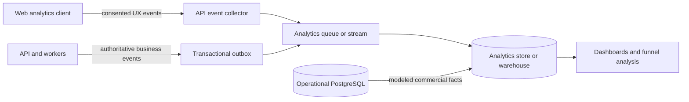

Recommended approach:

- Send browser events to the first-party `POST /v1/analytics/events` endpoint.
- Validate event names, schema versions, property types, consent state, and payload size.
- Generate authoritative commercial events from the API/worker that commits the state
  change, using the transactional outbox.
- Stream raw events into a dedicated analytics store or warehouse. Do not retain
  high-volume raw analytics indefinitely in the operational PostgreSQL database.
- Load modeled order, item, payment, refund, and provider-booking facts from PostgreSQL into
  the analytics store so funnel outcomes use operational truth.
- At small initial volume, a separate partitioned `analytics.events` PostgreSQL table is an
  acceptable temporary sink. It must have independent retention and must not be queried in
  customer-facing request paths.

Browser events measure interactions such as views, selections, and form steps. Server
events measure accepted quotes, created orders, provider holds, payments, confirmations,
cancellations, and refunds. Never rely on a browser event to declare a sale successful.

### 15.2 Event Envelope

Every analytics event must use a versioned envelope:

| Field | Purpose |
|---|---|
| `eventId` | UUIDv7 used for deduplication |
| `eventName` | Stable `snake_case` event name |
| `eventVersion` | Integer schema version |
| `occurredAt` | Client/server occurrence timestamp |
| `receivedAt` | Collector receipt timestamp |
| `source` | `web`, `api`, `worker`, or `backfill` |
| `anonymousId` | First-party pseudonymous visitor ID, when consent permits |
| `sessionId` | First-party session ID |
| `customerId` | Internal ID only when known and permitted; never email/phone |
| `cartId` | Stable cart journey ID |
| `quoteId` | Expiring quote ID, when applicable |
| `orderId` | Internal order ID, only after order creation |
| `requestId` | Correlation with API traces |
| `locale` | Site locale |
| `currency` | Display/transaction currency |
| `consent` | Consent category/version captured at event time |
| `context` | Page type, route template, referrer category, UTM IDs, device class |
| `properties` | Event-specific validated properties |

Rules:

- Never include names, email addresses, phone numbers, tax numbers, exact street addresses,
  guest documents, free-text notes, messages, or booking-question answers.
- Do not put analytics identifiers into provider payloads unless required for a documented
  attribution use case.
- Store route templates such as `/rooms/:slug`, not URLs that may contain identifiers or
  query-string personal data.
- Use internal/provider catalog IDs as dimensions; include title snapshots only when needed
  and sanitized.
- Preserve UTM/source attribution at session entry and on the order as a compact attribution
  snapshot if commercial attribution is required.
- Deduplicate on `eventId`. Server events should also have a deterministic business key,
  such as `order_confirmed:<order-id>`.

### 15.3 Core Event Taxonomy

Event names describe completed facts, not UI control labels.

#### Discovery

| Event | Source | Minimum properties |
|---|---|---|
| `search_submitted` | web | product type, destination/area, dates, party counts |
| `search_results_viewed` | web | product type, result count, search ID |
| `search_filters_applied` | web | search ID, normalized filter keys |
| `accommodation_viewed` | web | listing ID, search ID, position |
| `activity_viewed` | web | experience ID, search ID, position |
| `availability_requested` | API | product type, product ID, date range |
| `availability_returned` | API | result/slot count, latency bucket, cache outcome |

#### Selection and Cart

| Event | Source | Minimum properties |
|---|---|---|
| `accommodation_selected` | web | listing ID, dates, party counts, displayed price |
| `activity_selected` | web | experience ID, date, rate ID, start-time ID, party counts |
| `cart_created` | web/API | cart ID, initial product type |
| `cart_item_added` | web | cart ID, item type, product ID, displayed amount |
| `cart_item_removed` | web | cart ID, item type, product ID |
| `cart_viewed` | web | cart ID, item count, displayed total |
| `checkout_started` | web | cart ID, item count, displayed total |

Use `accommodation_selected` for the user's chosen room/property even if the UI labels it
as a room, apartment, home, or stay. Keep the analytics vocabulary stable across UI copy.

`cart_created` fires once when the first item is added. A cart ID should be generated as a
UUIDv7 and persisted first-party for the journey. If abandoned-cart recovery or cross-device
cart continuity becomes a product requirement, add authoritative PostgreSQL `carts` and
`cart_items` tables; analytics events alone are not sufficient.

#### Quote, Checkout, and Booking

| Event | Source | Minimum properties |
|---|---|---|
| `quote_requested` | API | cart ID, item types/count |
| `quote_succeeded` | API | quote ID, cart ID, amount, currency, expiry, provider mix |
| `quote_failed` | API | cart ID, normalized reason, provider |
| `checkout_step_viewed` | web | cart ID, stable step name |
| `checkout_validation_failed` | API | cart ID, stable field/reason code only |
| `order_created` | API | order ID, cart ID, amount, currency, provider mix |
| `provider_hold_created` | worker/API | order ID, item type, provider, hold duration |
| `payment_started` | API | order ID, amount, currency |
| `payment_succeeded` | worker | order ID, amount, currency |
| `payment_failed` | worker | order ID, normalized failure category |
| `booking_confirmed` | worker | order ID, item type, provider |
| `order_confirmed` | worker | order ID, amount, currency, item/provider mix |
| `order_partially_confirmed` | worker | order ID, succeeded/failed item counts |
| `order_cancelled` | worker | order ID, normalized reason |
| `refund_completed` | worker | order ID, item type, amount, currency |

Amounts in analytics use integer minor units. Failure events use a controlled reason
taxonomy; do not send raw provider errors or payment failure text.

### 15.4 Canonical Funnels

Maintain explicit funnel definitions so dashboard results do not change silently.

**Accommodation booking funnel**

`search_results_viewed -> accommodation_viewed -> accommodation_selected ->
cart_item_added -> checkout_started -> quote_succeeded -> order_created ->
payment_succeeded -> order_confirmed`

**Activity booking funnel**

`search_results_viewed -> activity_viewed -> activity_selected -> cart_item_added ->
checkout_started -> quote_succeeded -> order_created -> payment_succeeded ->
order_confirmed`

**Mixed-cart funnel**

`cart_created -> cart_viewed -> checkout_started -> quote_succeeded -> order_created ->
payment_succeeded -> order_confirmed`

Report each funnel by visitors, sessions, carts, orders, and order items. Use item-level
confirmation for provider/product conversion and order-level confirmation for commercial
conversion. Keep separate metrics for:

- selection-to-cart rate;
- cart-to-checkout rate;
- checkout-to-valid-quote rate;
- quote-to-payment rate;
- payment-to-confirmation rate;
- time to conversion;
- abandonment by stable checkout step;
- failure rate by provider and normalized failure category;
- gross booking value, confirmed booking value, refunds, and net booking value.

### 15.5 Attribution and Dimensions

Capture:

- first-touch and last-touch source/medium/campaign IDs;
- referring domain category;
- landing page route template;
- locale and market;
- product type, provider, listing/experience ID, city/area, and search result position;
- stay length, booking lead time, party-size bands, and price bands;
- device class and application version;
- experiment and variant IDs.

Derive sensitive or high-cardinality dimensions into approved bands before analysis. Do not
collect exact birth dates, exact guest locations, document attributes, or free text for
analytics.

### 15.6 Consent, Retention, and Access

- Separate strictly necessary operational telemetry from optional product analytics.
- Do not emit optional analytics before the applicable consent state permits it.
- Record consent category and policy version with each event.
- Support withdrawal/deletion workflows for pseudonymous analytics identifiers where
  applicable.
- Rotate pseudonymous visitor/session identifiers according to the approved privacy policy.
- Define raw-event retention separately from aggregated reporting retention.
- Restrict raw-event access; most users should consume governed dashboards and modeled data.
- Review the implementation and retention policy with GDPR/ePrivacy counsel before launch.

### 15.7 Data Quality

- Maintain event schemas in source control and validate them in CI and at ingestion.
- Document event owner, description, source, trigger, required properties, and version.
- Add automated tests that critical server events fire once for each state transition.
- Compare `order_created`, `payment_succeeded`, and `order_confirmed` analytics counts to
  operational PostgreSQL daily.
- Alert on missing events, duplicate spikes, invalid payloads, unknown event versions, and
  sudden funnel discontinuities.
- Version semantics when an event meaning changes; do not silently redefine an event.

## 16. Legacy Migration Mapping

Do not directly import the old `Order` document as the new order schema. Transform and
reconcile it.

| Legacy data | Target |
|---|---|
| `Order.orderId` | `orders.public_reference` |
| Order contact/company/tax fields | `order_contacts` |
| `Order.items[]` | `order_items` plus type-specific detail table |
| Accommodation item `fees[]` | `order_item_charges` |
| `reservationIds[]` + `reservationReferences[]` | Hostify `provider_bookings` rows |
| `transaction_id[]` | `provider_financial_records` |
| `activityBookingIds[]` + `activityBookingReferences[]` | Bokun `provider_bookings` rows |
| `payment_id` / `payment_method_id` | `payment_attempts` after Stripe reconciliation |
| Item invoice fields | `fiscal_documents` |
| `GuestData` | encrypted `booking_guests` + `guest_submission_jobs` |
| `Chat` / `Message` | `conversations` / `messages` |
| `HostkitApiKey` | secrets manager + `property_integrations` |
| `Admin` | selected authentication provider plus PostgreSQL role mapping |

Migration procedure:

1. Export legacy MongoDB collections to immutable migration files.
2. Import each legacy order into staging tables with the original raw document.
3. Transform items and map parallel arrays by item type and position.
4. Reconcile every Hostify reservation against Hostify.
5. Reconcile every Bokun booking against Bokun.
6. Reconcile every payment against Stripe.
7. Flag ambiguous or mismatched records for manual review.
8. Only then promote transformed rows into production tables.
9. Run old and new read models in parallel before switching checkout writes.

The migration must report:

- unmapped items;
- provider IDs referenced by multiple orders;
- order totals that do not match payment/provider totals;
- missing provider bookings;
- missing or duplicate payment intents;
- invoice references without matching items;
- guest records without matching reservations.

## 18. Decisions Still Required

These are blockers or material design decisions, not implementation details:

1. Confirm Hostify webhook event names, verification, retry behavior, and rate limits.
2. Confirm whether Hostify `pending` reservations hold inventory and their expiry behavior.
3. Confirm whether Hostify supports idempotent reservation creation/external references.
4. Decide whether Bokun remains on API-key authentication or moves to OAuth.
5. Confirm whether Hostkit remains the fiscal/guest-registration integration.
6. Select managed PostgreSQL, Redis, object storage, and secrets services.
7. Approve guest-data and fiscal-record retention with Portuguese legal/accounting advice.
8. Decide whether customer accounts exist or checkout remains guest-first.
9. Select the analytics sink/warehouse and approve analytics consent and retention policy.
10. Decide whether carts remain client-side journey IDs or become authoritative PostgreSQL
    records for abandoned-cart recovery and cross-device continuity.

## 19. Sources

### Current and Legacy Repositories

Legacy paths below are relative to
`E:\Ocean Informatix\AlojamentoIdeal.pt\alojamentoideal`.

- New app (current): `apps/web/app/api/*` route handlers, `packages/core/`, `packages/db/`
- Legacy MongoDB models: `models/Order.ts`, `models/GuestData.ts`, `models/Chat.ts`,
  `models/HostkitApiKey.ts`
- Legacy Hostify connector and schemas: `utils/hostify-request.ts`, `schemas/listing.schema.ts`,
  `schemas/full-listings.schema.ts`, `schemas/price.schema.ts`, `schemas/reservation.schema.ts`
- Legacy Hostify webhook/sync: `app/api/webhook/hostify/route.ts`,
  `app/api/sync/hostify/route.ts`
- Legacy Bokun connector and flows: `utils/bokun-server.ts`, `utils/bokun-requests.ts`,
  `app/actions/getExperience.ts`, `app/actions/getExperienceAvailability.ts`
- Legacy checkout/payment flow: `app/actions/completeCheckout.ts`,
  `app/api/webhook/stripe/route.ts`
- Legacy cancellation/refunds: `app/actions/cancelReservation.ts`,
  `app/actions/getExperience.ts`, `app/actions/deleteOrder.ts`
- Legacy messaging: `app/actions/postMessage.ts`, `app/actions/syncAutomatedMessages.ts`,
  `app/api/sync/hostify/route.ts`
- Legacy Hostkit and invoice flow: `app/api/sync/hostkit/route.ts`,
  `app/api/sync/invoices/route.ts`, `app/actions/createHouseInvoice.ts`

### Provider Documentation

- Hostify Open API and real-time webhooks:
  <https://hostify.com/features/api>
- Bokun API authentication and rate limits:
  <https://bokun.dev/booking-api-rest/vU6sCfxwYdJWd1QAcLt12i/configuring-the-platform-for-api-usage-and-authentication/sFiGRpo4detkmrZPcWtQPj>
- Bokun product details:
  <https://bokun.dev/booking-api-rest/vU6sCfxwYdJWd1QAcLt12i/get-product-details/m48RCWuoQY6RsVA7w9QhDt>
- Bokun availability and pricing:
  <https://bokun.dev/booking-api-rest/vU6sCfxwYdJWd1QAcLt12i/checking-availability-and-pricing/9x4PcziToX5g8WG4j5KMxt>
- Bokun booking process:
  <https://bokun.dev/booking-api-rest/vU6sCfxwYdJWd1QAcLt12i/booking-process/7ce3yQRdURnCYQkhJsi2op>
- Bokun reserve-then-confirm checkout:
  <https://bokun.dev/booking-api-rest/vU6sCfxwYdJWd1QAcLt12i/checkout/qfxwephtAWaRgPt22kpyLF>
- Bokun booking questions:
  <https://bokun.dev/booking-api-rest/vU6sCfxwYdJWd1QAcLt12i/booking-questions-and-answers/r69Hx5qrLtMXpYzBCC6NPp>
- Bokun webhook endpoint:
  <https://bokun.dev/webhooks/g3YWZ24sADsceKK5vqrMzZ/creating-an-endpoint-for-webhooks/fhyXqzU4KXuLWc7Dc8ioNU>
- Bokun webhook events:
  <https://bokun.dev/webhooks/g3YWZ24sADsceKK5vqrMzZ/webhook-events/migR39DGTnTr3qaRryEr7k>
- Stripe webhook handling:
  <https://docs.stripe.com/webhooks>
- Stripe idempotent requests:
  <https://docs.stripe.com/api/idempotent_requests>
- Stripe PaymentIntents:
  <https://docs.stripe.com/api/payment_intents>
- Stripe Connect destination-charge funds and refund flow:
  <https://docs.stripe.com/connect/destination-charges>
- Hostkit capabilities:
  <https://hostkit.pt/en/>
